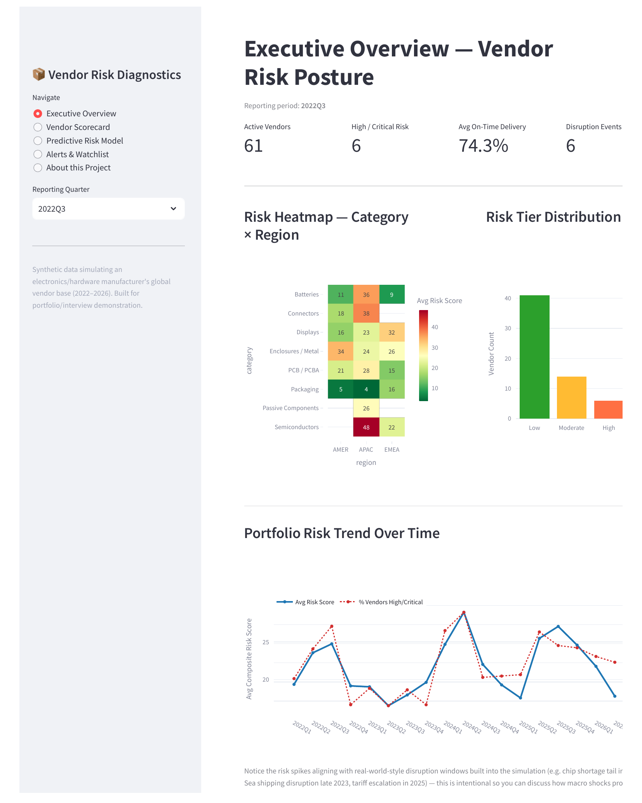
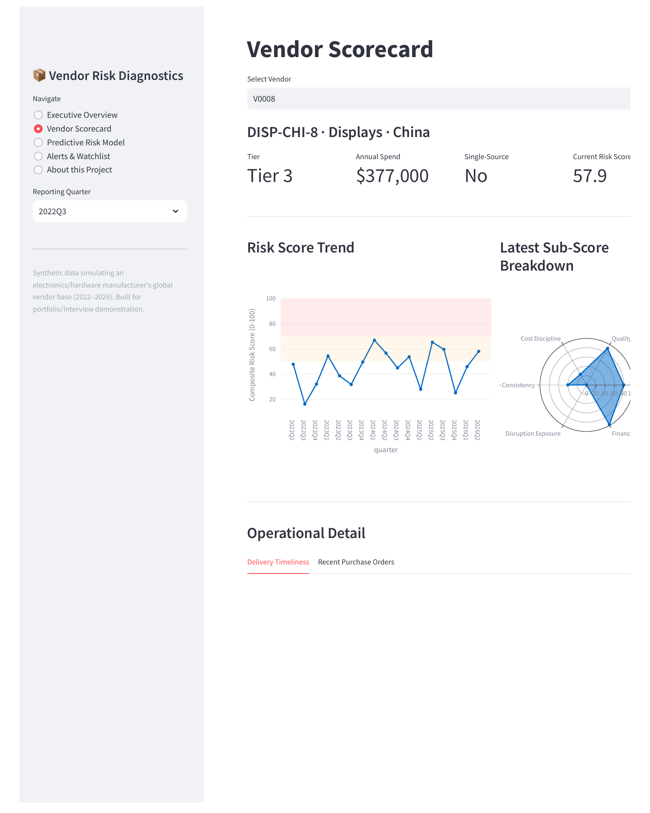

# Enterprise Supply Chain Operational Risk & Vendor Performance Diagnostics

A vendor risk monitoring and prediction system for a simulated global electronics/hardware
manufacturer — built to demonstrate real supply-chain analytics skills: data modeling,
business-rule scorecarding, predictive ML, and stakeholder-facing dashboarding.

---

## 1. The Business Problem

A hardware manufacturer sources components — semiconductors, PCBs, displays, connectors,
batteries, enclosures, packaging — from ~70 vendors spread across Asia, Europe, and the
Americas. Procurement and supply chain leadership need to answer two questions continuously:

1. **Which vendors are operationally risky *right now*?** (late deliveries, quality issues,
   cost overruns, single-source dependency)
2. **Which vendors are likely to *become* risky next quarter?** — so the team can act
   *before* a stockout or line-down event, not after.

This project builds both: a transparent scorecard for question 1, and a predictive model
for question 2.

## 2. Why This Isn't a Generic Kaggle Project

There's no public dataset of confidential internal vendor performance data — no real
company publishes their supplier scorecards. So instead of reusing a static, overused
dataset, this project **simulates the data-generation process** the way it would actually
happen inside an ERP/SRM system (SAP Ariba / Coupa-style), including:

- Realistic entity relationships (vendors → purchase orders → quality inspections →
  disruption events → financial signals)
- **Time-anchored macro shock periods** loosely inspired by real 2022–2026 supply chain
  events (2022 chip shortage tail, China regional lockdowns, late-2023 Red Sea shipping
  disruption, 2024 Taiwan seismic/grid strain, 2025–2026 tariff escalation). These windows
  are applied as a multiplier on **delivery delay, cost variance, and financial-health
  signals** for affected regions/categories — verified in `notebooks/01_exploratory_data_analysis.ipynb`,
  portfolio-wide on-time delivery genuinely dips in each window (e.g. 2022Q2–Q3: ~69%/67%,
  2025Q2–Q4: ~66%/61%/65%, vs. a ~76% baseline). Note: the discrete `disruption_events.csv`
  table (named incidents like strikes/cyber events) is generated as a separate per-vendor
  random process and does **not** itself show strong count-level clustering in these windows
  — only its severity distribution is nudged. Be precise about this distinction if asked in
  an interview: the *delivery/cost/financial* signals carry the macro-shock realism, not the
  discrete event log.
- Archetype-driven vendor behavior (some vendors are structurally reliable, some are
  structurally risky) so the data has genuine, learnable signal — not random noise

## 3. Project Architecture

```
vendor-risk-project/
├── src/
│   ├── generate_data.py       # Step 1: simulate raw transactional data
│   ├── build_features.py      # Step 2: raw data -> vendor-quarter feature table
│   ├── rule_based_score.py    # Step 3: transparent weighted risk scorecard
│   ├── train_model.py         # Step 4: predictive ML model + benchmark comparison
│   └── make_notebook.py       # generates the EDA notebook
├── notebooks/
│   └── 01_exploratory_data_analysis.ipynb
├── data/                      # generated CSVs (raw + feature tables + scores)
├── models/                    # trained model files + evaluation outputs
├── dashboard/
│   └── app.py                 # Streamlit interactive dashboard
├── run_pipeline.py            # runs steps 1-4 end to end
├── requirements.txt
└── README.md                  # this file
```

### Data flow (how the pieces connect)

```
generate_data.py
   → vendors.csv, purchase_orders.csv, quality_inspections.csv,
     disruption_events.csv, vendor_financial_signals.csv
        ↓
build_features.py   (aggregates transactions to vendor × quarter grain,
                      builds trailing/rolling features, defines the
                      "high_risk_next_quarter" prediction target)
        ↓
   vendor_quarter_features.csv
        ↓
   ┌────────────────────┬──────────────────────┐
   ↓                                            ↓
rule_based_score.py                      train_model.py
(transparent weighted scorecard)         (Logistic Regression + Random Forest,
   ↓                                       benchmarked against the rule-based score)
vendor_risk_scores.csv                          ↓
   ↓                                      models/*.pkl, model_comparison.csv
   └──────────────────┬───────────────────┘
                       ↓
              dashboard/app.py (Streamlit)
```

## 4. Screenshots

**Executive Overview** — portfolio-wide risk heatmap, tier distribution, and trend:



**Vendor Scorecard** — drill-down into a single vendor's risk trend and sub-score breakdown:



## 5. How To Run It

```bash
# 1. Install dependencies
pip install -r requirements.txt

# 2. Run the full data + modeling pipeline
python run_pipeline.py

# 3. Launch the interactive dashboard
streamlit run dashboard/app.py
```

Everything is seeded (`SEED = 42`), so re-running `run_pipeline.py` reproduces identical
results — an important, deliberate detail for a project you want to demo reliably.

## 6. Methodology Deep-Dive

### 6.1 Rule-based composite risk score (the transparent layer)

Each vendor-quarter gets six sub-scores (0–100, higher = riskier), each built by
min-max normalizing a raw operational signal (with outlier clipping at the 98th
percentile so one freak event can't dominate the score):

| Sub-score | Signal | Weight |
|---|---|---|
| On-time delivery risk | On-time delivery rate (inverted) | 25% |
| Quality risk | Average defect rate | 20% |
| Cost risk | Absolute cost variance vs. quoted price | 15% |
| Lead-time consistency risk | Std. deviation of delivery delay | 15% |
| Disruption exposure risk | Severity-weighted disruption event count | 15% |
| Financial health risk | Credit health score proxy (inverted) | 10% |

These combine into a **weighted composite score**, then a **concentration risk
multiplier** (+15%, capped at 100) is applied to vendors that are both single-source
*and* in the top quartile of spend — because losing that vendor would hurt
disproportionately, which is a structural risk, not a performance metric, so it's
handled separately rather than averaged in.

**Why weights, not equal averaging?** In a real procurement org, delivery reliability
and quality failures cause immediate production impact, so they're weighted higher
than, say, cost variance, which is painful but rarely stops a production line.

### 6.2 Predictive ML model (the forward-looking layer)

The rule-based score describes **current** risk. The ML model tries to answer a
harder, more valuable question: *"given this vendor's behavior this quarter, how
likely are they to breach SLA or have a major disruption **next** quarter?"*

- **Target:** `high_risk_next_quarter` — a vendor-quarter is labeled 1 if, in the
  *following* quarter, the vendor has OTD < 75%, OR a disruption event of severity
  High/Critical, OR a lot rejection rate > 15%.
- **Leakage-safe by design:** the target uses only *future* information for the
  label, and the model only sees *current and trailing* features — never data from
  the quarter being predicted.
- **Models trained:** Logistic Regression (interpretable baseline) and Random Forest
  (captures non-linear interactions). Both evaluated with a random train/test split
  *and* a time-based split (train on earlier quarters, test on later ones — the more
  rigorous approach for a forecasting problem, included specifically so you can
  discuss the trade-off in an interview).
- **Benchmarked directly against the rule-based score** used as a naive classifier,
  so the value-add of ML over a simple business formula is quantified, not assumed.

**Result:** ROC-AUC around 0.70–0.75 for the ML models, modestly beating the
rule-based benchmark (~0.70). This is a *realistic, credible* result for a noisy
operational forecasting problem — deliberately not "too good to be true."

## 7. Key Files 
| File | What it demonstrates |
|---|---|
| `src/generate_data.py` | Data modeling, understanding of ERP/SRM entity relationships, simulating realistic time-series shocks |
| `src/build_features.py` | Feature engineering, aggregation, rolling/trailing windows, leakage-safe target definition |
| `src/rule_based_score.py` | Translating business logic into transparent, defensible scoring — a core "analyst" skill |
| `src/train_model.py` | ML modeling, train/test methodology, evaluation metrics, benchmarking against a baseline |
| `dashboard/app.py` | Stakeholder communication, dashboard design, translating data into decisions |

## 8. Limitations & Assumptions

- All data is synthetic. It's realistically structured and time-anchored, but it doesn't reflect any real company's actual vendors.

- The financial "credit health score" is a proxy, not real credit bureau data.

- The rule-based weights (25/20/15/15/15/10) are a reasonable, defensible starting point but would need validation against real business outcomes (e.g., "does a high score actually predict cost-of-poor-quality?") in a production setting.

- ROC-AUC of ~0.72 means the model is useful for prioritization (who to review first), not a guarantee — it should support human judgment, not replace it.

- The discrete `disruption_events.csv` log (named incidents like strikes or cyber events) is generated as an independent per-vendor random process and does not itself show strong count-level clustering around the macro shock windows — only its severity distribution is nudged. The macro-shock realism is reflected in the delivery delay, cost variance, and financial-health signals, which were verified in the EDA notebook to dip/spike in the expected windows.

- `.pkl` model files are pinned to the exact scikit-learn/pandas/numpy versions in `requirements.txt` because scikit-learn does not guarantee pickle compatibility across versions — an important operational detail when shipping trained models.
### Developed by Arvind Yadav

Connect with me for Data Analyst or related roles.


### Related Project

Related project: see [vendor-risk-bi-diagnostics](https://github.com/arvind-yadav-vit/vendor-risk-bi-diagnostics) for the same problem solved with Excel + Power BI.
